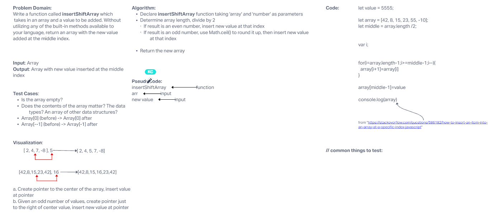
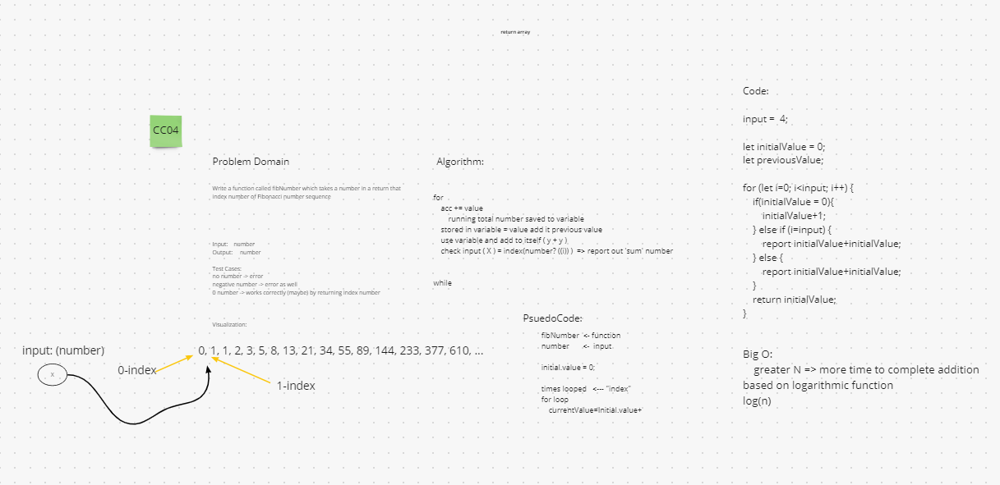
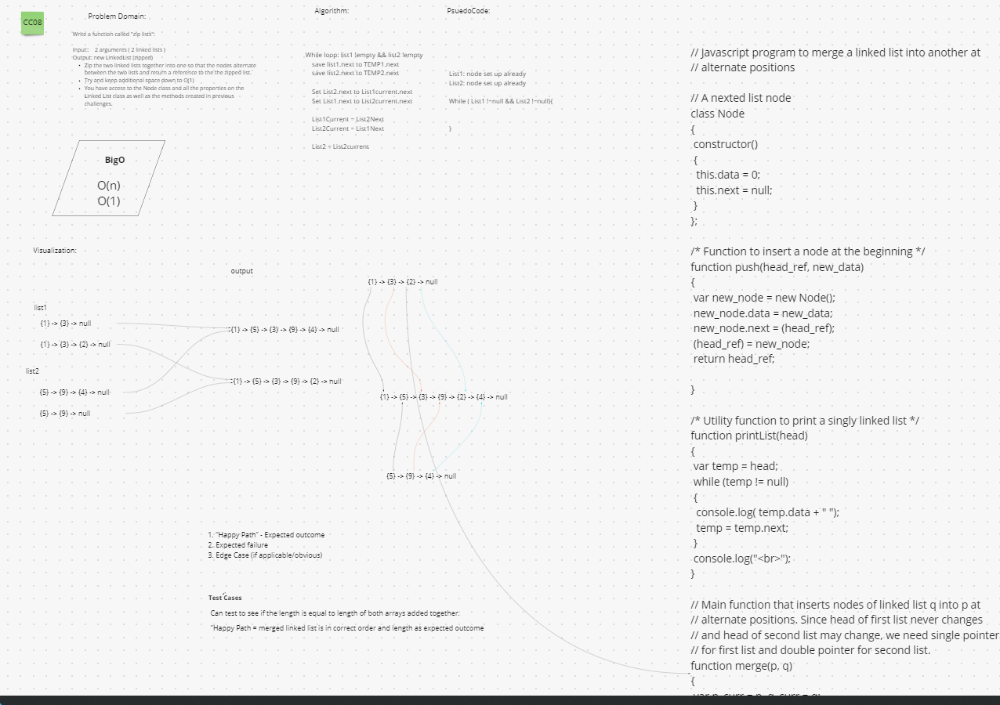
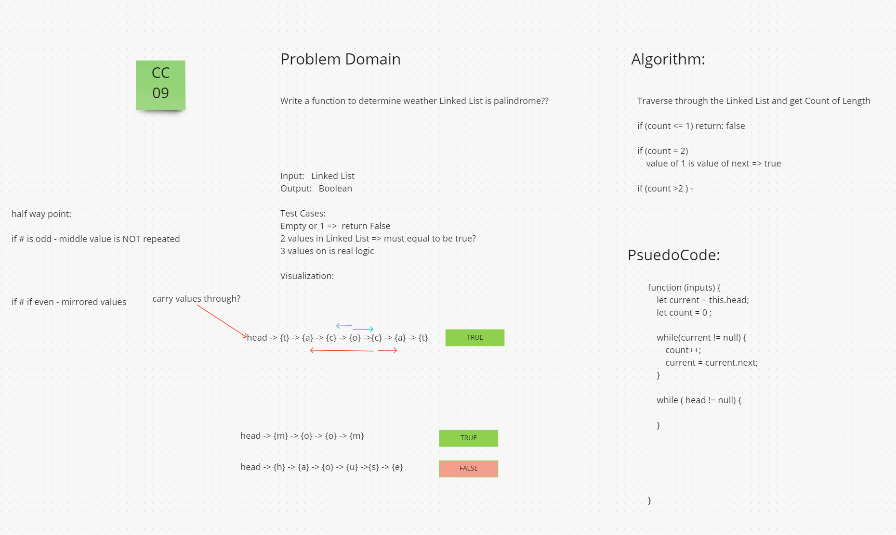
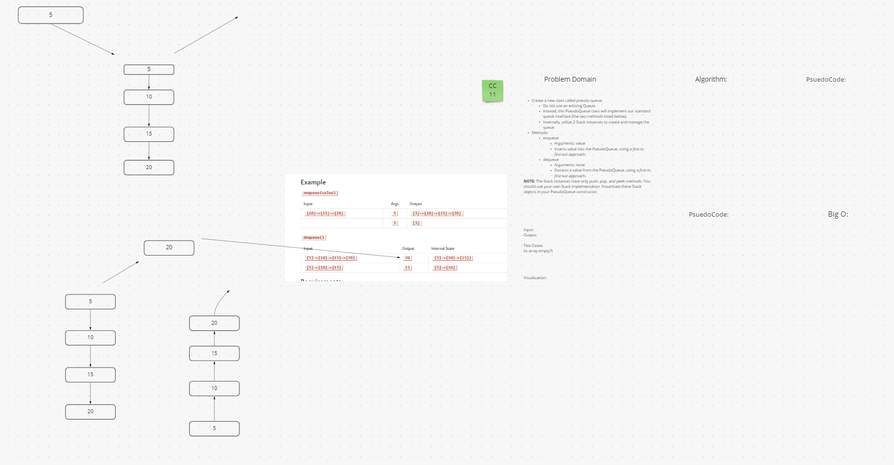
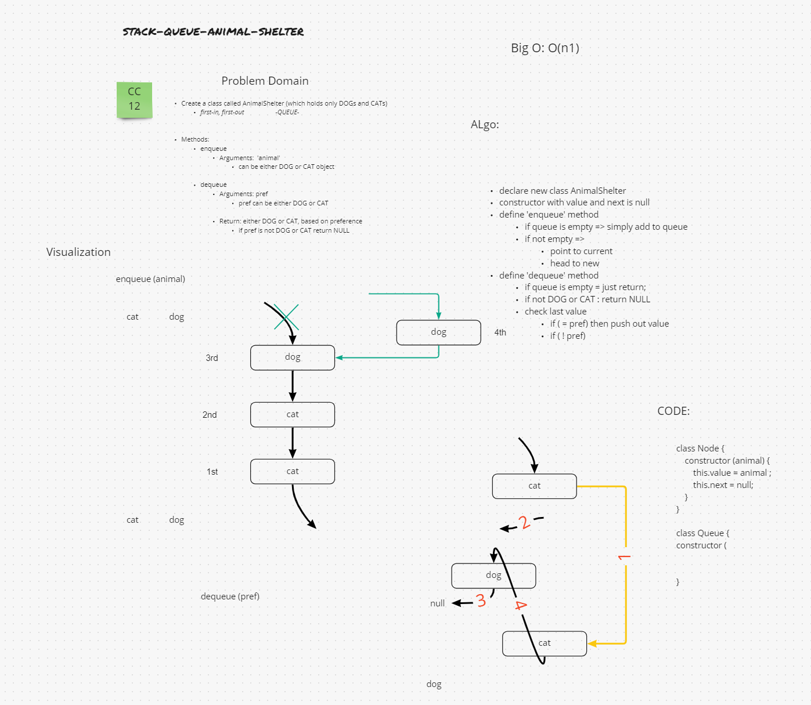

# 401 Challenges by Day and Number

* [Code Challenge 01](./array-reverse/README.md)
  
* [Code Challenge 02](./array-insert-shift/README.md)
  
* [Code Challenge 03](./array-binary-search/README.md)
  
* [Code Challenge 04 - Mock Interviews](./cc04-interviews/README.md)
  
* [Code Challenge 05 - Linked List Implementation](./linked-list-imp/README.md)
  
* [Code Challenge 06 - Extended Linked List](./linked-list-ext/README.md)
  
* [Code Challenge 07 - Link List k-th](./linked-list-kth/README.md)
  
* [Code Challenge 08](./linked-list-zip/README.md)
  
* [Code Challenge 09 - Linked List - palindrome?](./cc08-interviews/README.md)
  
* [Code Challenge 10 - Stacks and Queues](./stacks-queues/README.md)
  
  
* [Code Challenge 11 - Stack-Queue-Pseudo](./stack-queue-pseudo/README.md)
  
* [Code Challenge 12 - First-in, First out Animal Shelter](./stack-queue-animal-shelter/README.md)
  
