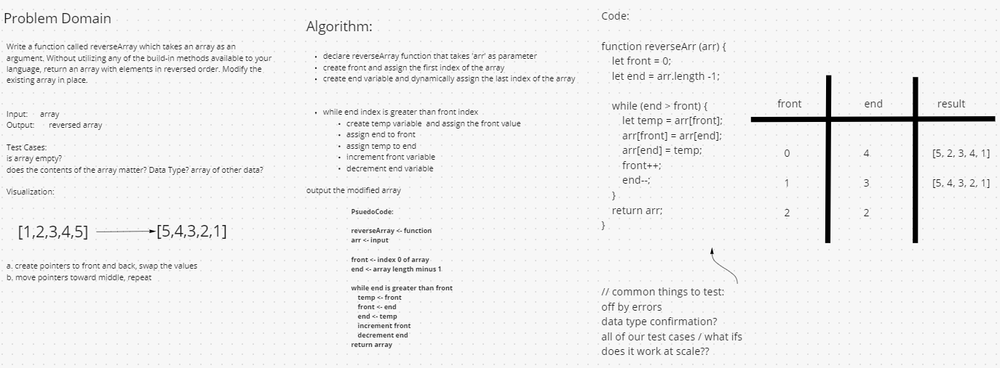
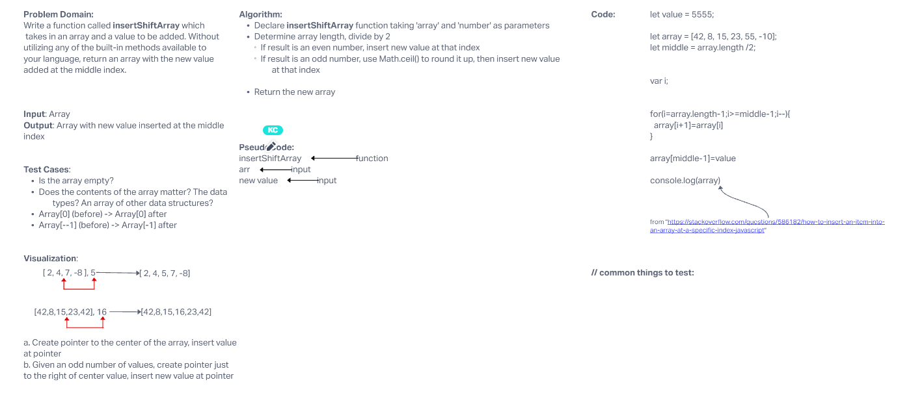

# Reverse an Array

Write a function called reverseArray which takes an array as an argument. Without utilizing any of the built-in methods available to your language, return an array with elements in reversed order.

### Whiteboard Process

* 

### Approach & Efficiency

Instructor worked through whiteboard exercise for class.

# Insert to Middle of an Array

Write a function called insertShiftArray which takes in an array and a value to be added. Without utilizing any of the built-in methods available to your language, return an array with the new value added at the middle index.

### Whiteboard Process

* 

### Approach & Efficiency

Similar to the first challenge. Layed out _Problem Domain_ and the statement to solve. _Visualization_ of the arrays with expected output.

Drew up algorithm and thought about what type of code to use. Decided on a for loop and filtered down until we could come up with the logic to return the modified array.

# Binary Search of Sorted Array

Write a function called BinarySearch which takes in 2 parameters: a sorted array and the search key. Without utilizing any of the built-in methods available to your language, return the index of the array’s element that is equal to the value of the search key, or -1 if the element is not in the array.

## Whiteboard Process

* 

## Approach & Efficiency

Worked our way through what we determined was the _Problem Domain_ and the question being asked. Logic our way through being able to see determine halfway point and if the number was equal then report index value or give another number in return.

Came through our algorithm and pseudocode with ability to write the code pretty close. Hard to rework if was a for loop or while.
