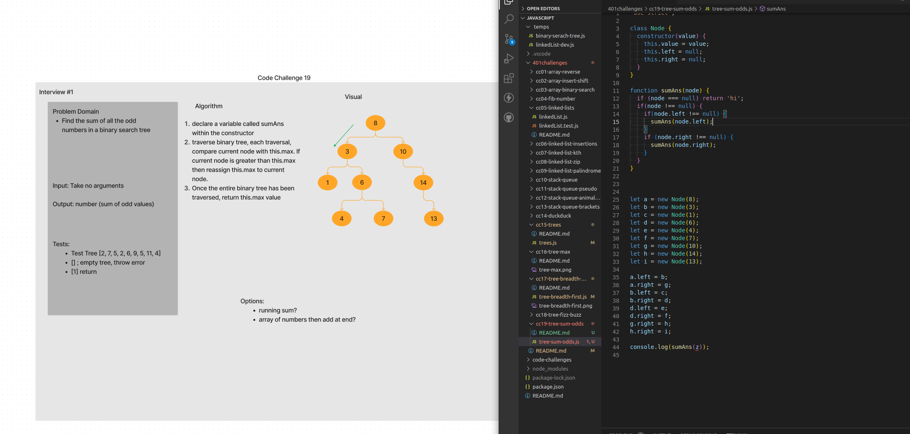
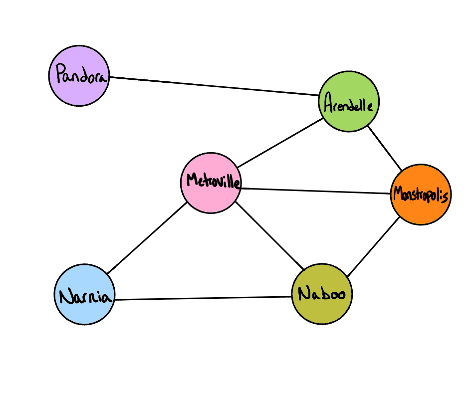
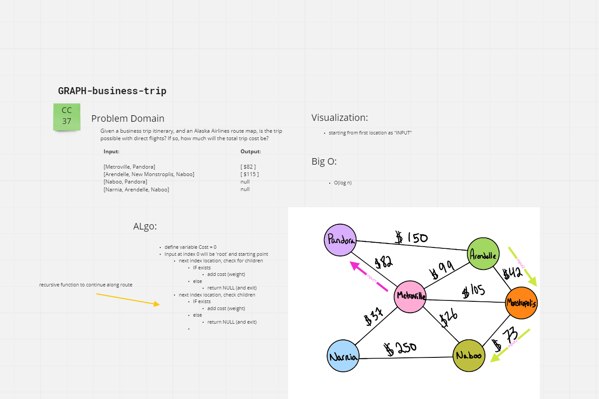

# 401 Challenges by Day and Number

- [Code Challenge 01 - Array, reverse](./cc01-array-reverse/README.md)
  

- [Code Challenge 02 - Array, insert shift](./cc02-array-insert-shift/README.md)
  

- [Code Challenge 03 - Array, binary search](./cc03-array-binary-search/README.md)
  

- [Code Challenge 04 - Fibonacci Sequence number](./cc04-fib-number/README.md)
  

- [Code Challenge 05 - Linked Lists](./cc05-linked-lists/README.md)
  <!--  -->

- [Code Challenge 06 - Linked List - Insertions](./cc06-linked-list-insertions/README.md)
  <!--  -->

- [Code Challenge 07 - Linked List - k-th](./cc07-linked-list-kth/README.md)
  <!--  -->

- [Code Challenge 08 - Linked List - Zip 2 Lists](./cc08-linked-list-zip/README.md)
  

- [Code Challenge 09 - Mock Interview - Linked List a palindrome?](./cc09-linked-list-palindrome/README.md)
  

- [Code Challenge 10 - Stack and Queue](./cc10-stack-queue/README.md)
  
  

- [Code Challenge 11 - Stack-Queue-Pseudo](./cc11-stack-queue-pseudo/README.md)
  

- [Code Challenge 12 - Stack Queue Animal Shelter](./cc12-stack-queue-animal-shelter/README.md)
  

- [Code Challenge 13 - Stack Queue Brackets](./cc13-stack-queue-brackets/README.md)
  

- [Code Challenge 14 - Mock Interview - DuckDuckGoose](./c14-duckduck/README.md)
  

- [Code Challenge 15 - Binary Tree and BST](./cc15-trees/README.md)
  <!--  -->

- [Code Challenge 16 - Max Value in Binary Tree](./c16-tree-max/README.md)
  

- [Code Challenge 17 - Tree, breadth first](./cc17-tree-breadth-first/README.md)
  

- [Code Challenge 18 - K-ary Tree, fizz buzz](./cc18-tree-fizz-buzz/README.md)
  <!--  -->

- [Code Challenge 19 - Tree, sum Odd node values](./cc19-tree-sum-odds/README.md)
  

- [Code Challenge 26 - Insertion Sort](./cc26-insertion-sort/README.md)
  <!--  -->

- [Code Challenge 27 - Merge Sort](./cc27-merge-sort/README.md)
  <!--  -->

- [Code Challenge 28 - Sort, provided list](./cc28-sort/README.md)
  <!--  -->

- [Code Challenge 29 - Insertion Sort - Interview](./cc29-insertion-sort-interview/cc29%20interview.png)
  

- [Code Challenge 30 - Hash Table Implementation](./cc30-hash-table/README.md)
  <!-- ![hash-table implementation] -->

- [Code Challenge 31 - Hash Table - Repeated Words](./cc31-hashmap-repeated-word/README.md)
  <!--  -->

- [Code Challenge 32 - Hash Table - 2 binary trees, common values](./cc32-hashmap-treeintersection/README.md)
  

- [Code Challenge 33 - Hash Table - Left Join for 2 Hashmaps](./cc33-hashmap-join-left/README.md)
  

- [Code Challenge 34 - Hash Table - Most Common Word](./cc34-hashmap-most-common-word/README.md)
  

- [Code Challenge 35 - Graph Implementation](./cc35-graph/README.md)
  <!--  -->

- [Code Challenge 36 - Graph, breadth first](./cc36-graph-breadth-first/README.md)
  

- [Code Challenge 37 - Graph, Business Trip](./cc37-graph-business-trip/README.md)
  

- [Code Challenge 38 - Graph, depth first](./cc38-graph-depth-first/README.md)
  
