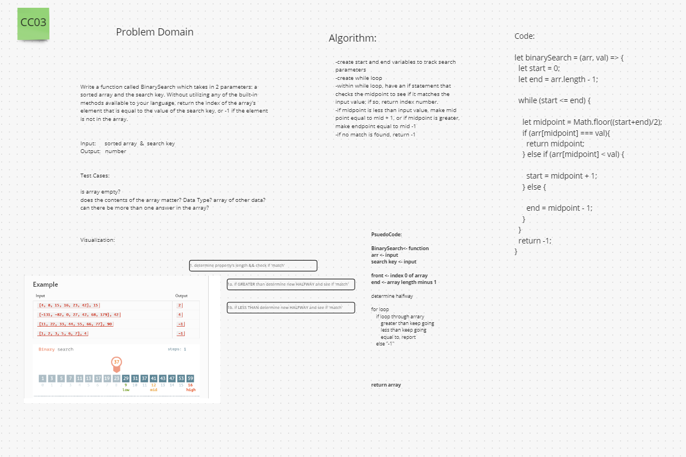

# Binary Search of Sorted Array

Write a function called BinarySearch which takes in 2 parameters: a sorted array and the search key. Without utilizing any of the built-in methods available to your language, return the index of the array’s element that is equal to the value of the search key, or -1 if the element is not in the array.

## Whiteboard Process

* 

## Approach & Efficiency

Worked our way through what we determined was the _Problem Domain_ and the question being asked. Logic our way through being able to see determine halfway point and if the number was equal then report index value or give another number in return.

Came through our algorithm and pseudocode with ability to write the code pretty close. Hard to rework if was a for loop or while.
