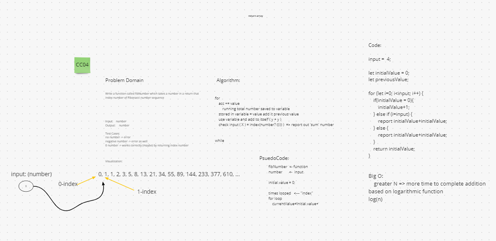
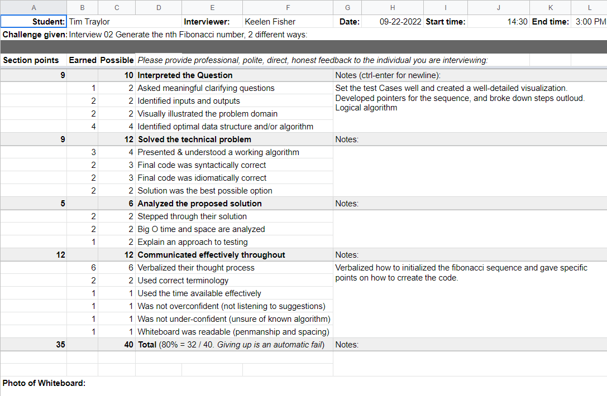

# Mock Interview

[CC04](https://canvas.instructure.com/courses/5233640/assignments/32144421)
  Write a function which accepts number and returns that index of Fibonacci's number sequence

## Whiteboard Process

  

## Approach & Efficiency

  Assumed we needed to create a new list and have to temp variable for each of the lists to hold while inserting into new Linked List.

## Solution

  
  Closer to the answer but not sure it it goes far enough.
