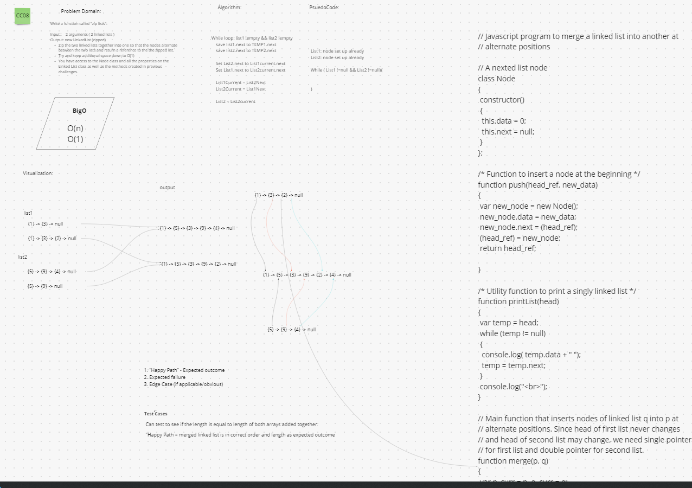

# Linked List Zip

## Challenge

- [CC08](https://canvas.instructure.com/courses/5233640/assignments/32144425)

- Write a function called zip lists which takes in 2 arguments of linked lists. Then will return New Linked List, zipped together into one so that the nodes alternate between the two lists and return a reference to the the zipped list.

## Whiteboard Process

  

## Approach & Efficiency

  Assumed we needed to create a new list and have to temp variable for each of the lists to hold while inserting into new Linked List.

## Solution

  Run `node /cc08-linked-list-zip/linked-list-zip-tk2.js` in terminal.

* https://www.geeksforgeeks.org/merge-a-linked-list-into-another-linked-list-at-alternate-positions/
