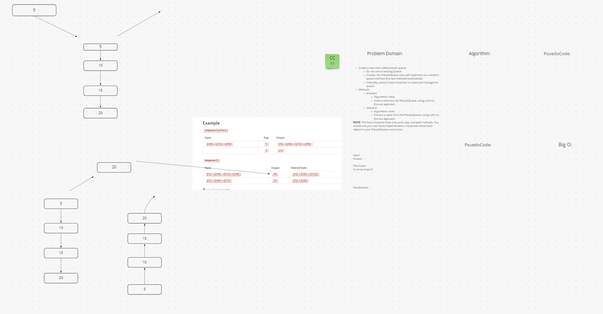

# Linked List Zip

[CC11](https://canvas.instructure.com/courses/5233640/assignments/32144428)

* Create a new class called pseudo queue.
  * Do not use an existing Queue.
  * Instead, this PseudoQueue class will implement our standard queue interface (the two methods listed below),
  * Internally, utilize 2 Stack instances to create and manage the queue

* Methods:
  * enqueue
    * Arguments: value
    * Inserts value into the PseudoQueue, using a first-in, first-out approach.
  * dequeue
    * Arguments: none
    * Extracts a value from the PseudoQueue, using a first-in, first-out approach.

## Whiteboard Process

  

## Approach & Efficiency

  Couldn't come up with a good answer to the process. Misunderstood the problem I think.

## Solution
