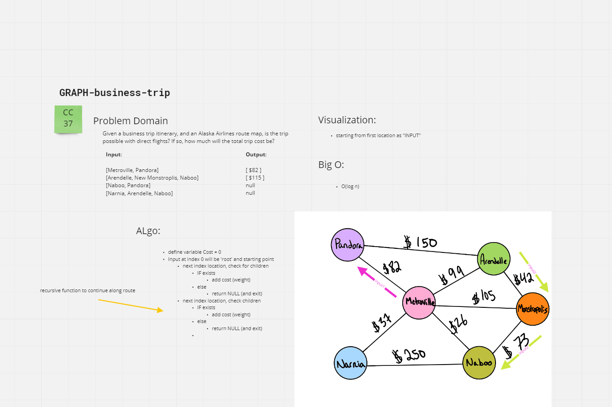

# Graphs - Business Trip

## Challenge

[CC37](https://canvas.instructure.com/courses/5233640/assignments/32144449)

## Approach & Efficiency

Followed lots of the sample code from Ryan. Was pretty hard to get the functions to output correctly. The confusion of map and set was difficult based on needing to put direct edges and things. Will revisit.

[drawing of problem](./cc37-problem.png)

