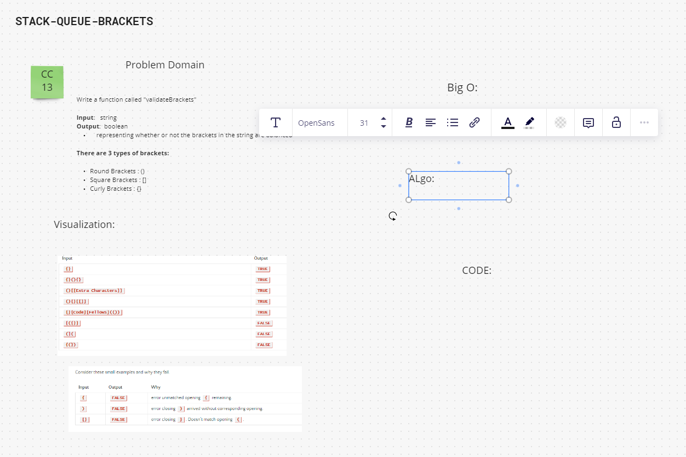

# Code Challenge 13 - Stack Queue Brackets

Take in string and output True/False for weather brackets are correctly balanced in the expression.

## Whiteboard Process

## Approach & Efficiency

## Solution

